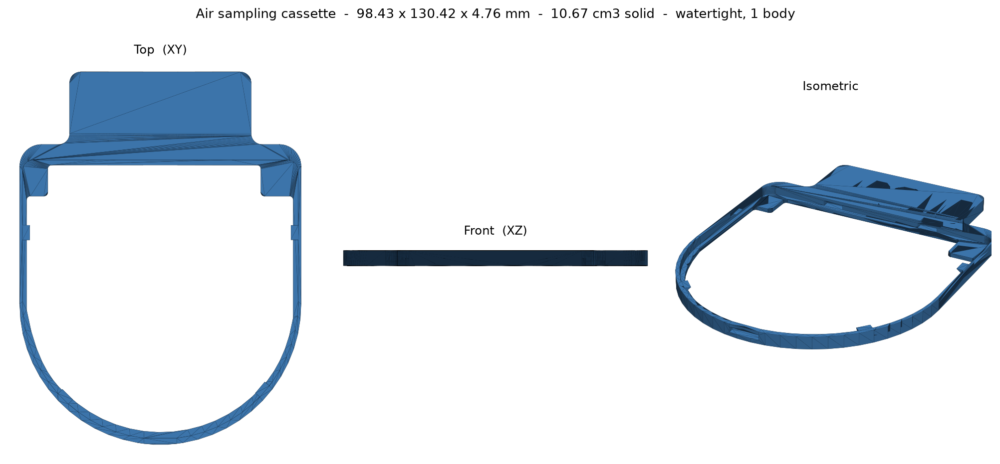
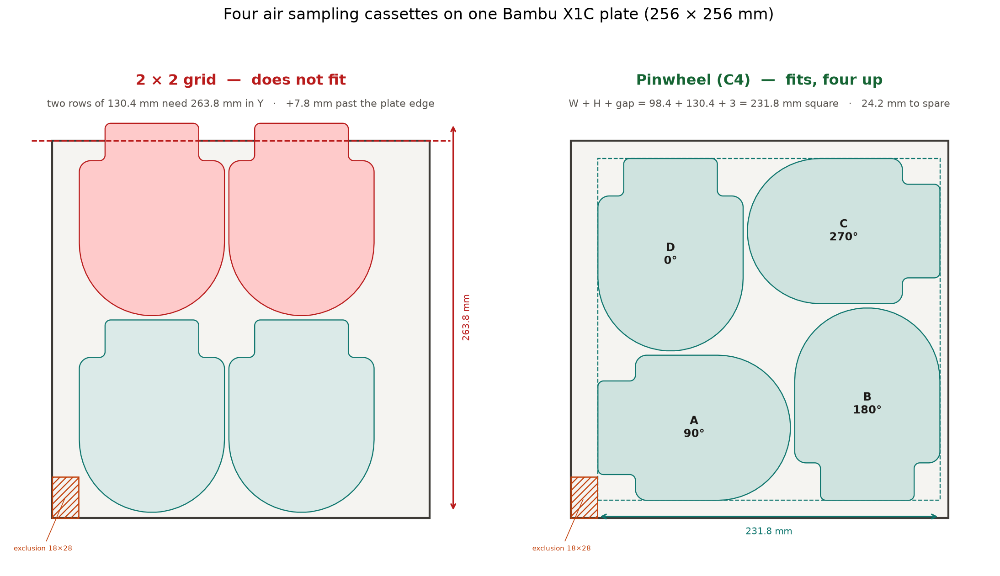

# Air sampling cassette

An open-source part released with [Printagent](../README.md). The STL is production
geometry, published here so anyone can download and print it.



## Download

**[`air-sampling-cassette.stl`](air-sampling-cassette.stl)** — 137 KB binary STL, 2,740 triangles.

Revision `2026-07-01` (original filename `7-1-26 Prod Cassette.stl`).

## Measured geometry

Every number below was measured off the mesh itself with `trimesh`, not copied from a drawing.

| Property | Value |
|---|---|
| Bounding box | 98.425 × 130.420 × 4.763 mm  (3.8750 × 5.1347 × 0.1875 in) |
| Wall thickness (nominal) | 4.763 mm = **3/16 in** exactly |
| Solid volume | 10 674.8 mm³ (10.675 cm³) |
| Surface area | 11 000.3 mm² |
| Solid mass estimate | ≈13.2 g PLA, ≈13.6 g PETG (100 % infill) |
| Topology | watertight, consistent winding, 1 body, genus 4 |
| Degenerate faces | 0 |

The part is a flat, constant-thickness frame: a U-shaped band closed by a rectangular tab at
one end. Feature steps land on Z = 0, 1.588, 2.223, 2.858, 3.493, 4.763 mm — i.e. 0, 1/16,
0.0875, 0.1125, 0.1375, 3/16 in. The model was authored in inches; the STL, per the format's
convention, carries no units, so **import it as millimetres**. A slicer that assumes inches
will scale it 25.4× too large.

## Printing it

The geometry is flat and thin, so it lies straight on the bed in its native orientation with the
98.4 × 130.4 mm face down — no rotation needed, and it fits any common 180 mm or larger bed.
Print it solid or near-solid: at 4.76 mm tall the whole part is essentially wall and the infill
saving is negligible.

A real slice of the four-up plate below confirms it prints support-free in this orientation on
an X1C. The Printagent gates themselves (`reviewing-manufacturability-fdm`,
`orienting-for-fdm`) have **not** been run against this mesh, so minimum wall, drainage, and
overhang have not been checked against *your* printer and material — run them yourself if you
are changing nozzle, layer height, or material.

## Four up on one X1C plate



Four cassettes fit a single 256 × 256 mm X1C plate, but **only in a pinwheel**. The obvious
2 × 2 grid does not fit and never will: two rows of the 130.420 mm dimension need
263.84 mm in Y, which is 7.84 mm past the edge of the plate.

Rotating alternate parts 90° changes the arithmetic. Four W × H rectangles tile a
(W + H) square with C4 rotational symmetry, so the plate only has to swallow
**W + H + gap** instead of 2 × H:

```text
2 x 2 grid      2 x 130.420 + 3   = 263.84 mm  ->  7.84 mm over    X
pinwheel (C4)   98.425 + 130.420 + 3 = 231.85 mm  ->  24.16 mm spare  OK
```

That is the whole trick. It needs no interlocking and no nesting of the U-shaped profiles —
plain bounding boxes are enough.

### The layout

Origin of the pinwheel block is **(18.5, 12.08)**, gap 3 mm, each part rotated 90° more than
the last:

| Part | Rotation | X range (mm) | Y range (mm) | Centre (mm) |
|:---:|:---:|---|---|---|
| A | 90° | 18.50 → 148.92 | 12.08 → 110.50 | (83.71, 61.29) |
| B | 180° | 151.92 → 250.35 | 12.08 → 142.50 | (201.13, 77.29) |
| C | 270° | 119.93 → 250.35 | 145.50 → 243.92 | (185.14, 194.71) |
| D | 0° | 18.50 → 116.93 | 113.50 → 243.92 | (67.71, 178.71) |

Measured clearance is 3.00 mm between each adjacent pair and 52.05 mm across the diagonals,
with zero overlap.

The X origin is 18.5 rather than centred for a reason: the X1C reserves an **18 × 28 mm
exclusion zone** at the front-left corner, and in a pinwheel some part always occupies that
corner. Pushing the block clear in X is the only option — clearing it in Y instead would cap the
block at 228 mm, which is smaller than the 231.85 mm it needs. That also bounds the gap:
x₀ ≥ 18 means the block can be at most 238 mm, so **the gap can be anywhere from 0 to about
9.15 mm**. 3 mm is a comfortable middle.

### Ready to print

**[`air-sampling-cassette-4up-x1c.3mf`](air-sampling-cassette-4up-x1c.3mf)** is the plate above,
laid out and ready. Open it in Bambu Studio and slice with arrange turned **off** — auto-arrange
spaces parts far too generously and will drop you back to one part per plate.

Verified by actually slicing it, not just by checking the geometry — Bambu Studio 02.07 CLI,
X1C 0.4 nozzle, 0.20 mm Standard, PLA Basic, `--arrange 0 --orient 0`:

| | |
|---|---|
| Result | sliced clean, exit 0, layout preserved |
| Print time | **1 h 20 m** for all four (4 823 s) |
| Filament | 41.54 g for the plate |
| Supports | **none** — `support_used: false` |
| Layers | 24 at 0.20 mm |

Overhang and bridge features do appear in the gcode, but they resolve without support.


## License

MIT, the same as the rest of this repository — see [LICENSE](../LICENSE). Use it for anything,
including commercial work; just keep the copyright line.
